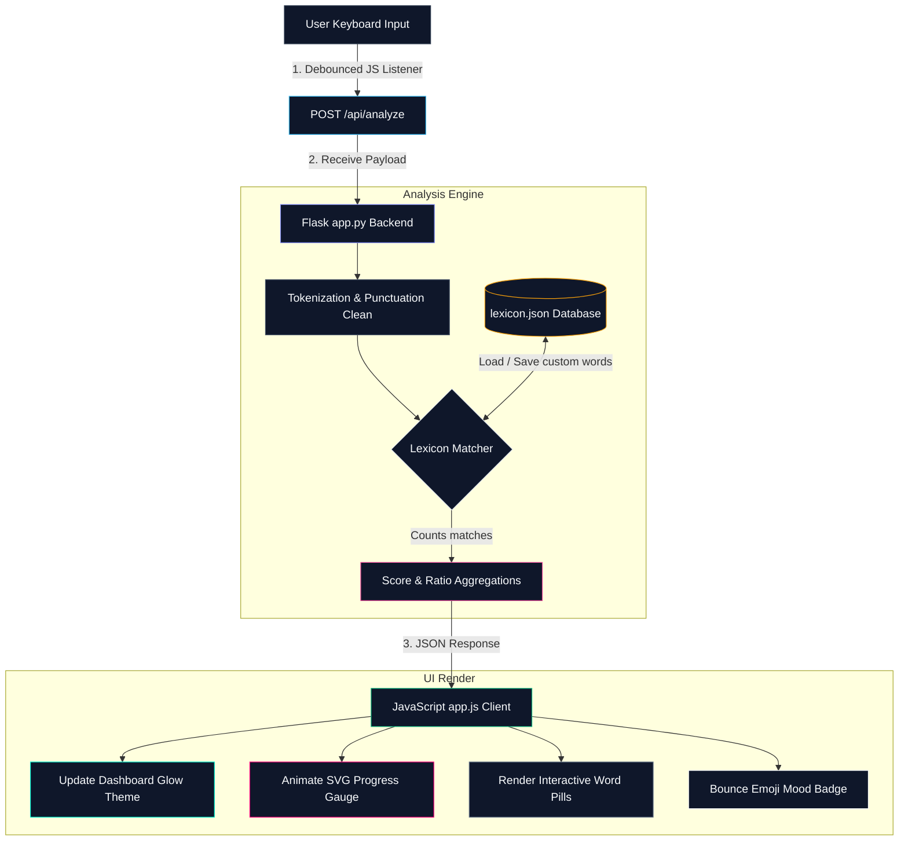

# 🌟 AI Text Sentiment Analyzer

<div align="center">


</div>

A modern, interactive, and visually stunning web-based dashboard application built using **Python (Flask)** on the backend and **Vanilla HTML5, CSS3, and JavaScript** on the frontend. It performs **real-time sentiment analysis** on user input and visualizes results dynamically.

---

## 📐 Architecture Diagram

Below is the flowchart representing the Flask client-server architecture:



---

## ✨ Features

- **⚡ Real-Time Web Analysis**: Keystroke binding with a 250ms debouncer. The JavaScript client continuously communicates with the Flask server API without reloading the page.
- **🎨 Premium Glassmorphic Web UI**: A dark-mode dashboard styled with dynamic neon drop-shadows and subtle glass borders that dynamically change colors (Teal for positive, Pink for negative, Slate for neutral).
- **📊 SVG Circular Gauge**: An animated SVG-drawn ring visualizing the exact balance of positive-to-negative words.
- **🎭 Dynamic Animated Mood Indicator**: High-fidelity emojis that perform scale-up/bounce animations whenever the sentiment classification shifts.
- **🎛️ Live Lexicon Manager**: Add or remove custom words directly from the browser listboxes. The additions are instantly saved to the server and written to `lexicon.json`, surviving server restarts.
- **🚀 Examples Deck**: Quick buttons to instantly load positive, negative, and mixed sentences for testing.

---

## 🛠️ How it Works

1. **Clean & Tokenize**: The Flask backend strips all punctuation, converts text to lowercase, and splits it into list tokens.
2. **Lexicon Matching**: Tokens are compared against the positive and negative lists loaded from `lexicon.json`.
3. **Scoring**:
   - If $\text{Positive} > \text{Negative} \rightarrow$ **POSITIVE** (🌟 Emoji)
   - If $\text{Negative} > \text{Positive} \rightarrow$ **NEGATIVE** (😢 Emoji)
   - If $\text{Positive} == \text{Negative} \rightarrow$ **NEUTRAL** (😐 Emoji)
4. **Data Sync**: Lexicon updates (add/remove) are written back to `lexicon.json` on the server immediately, and the client automatically triggers a re-analysis.

---

## 🚀 Getting Started

### Prerequisites
- **Python 3.x** installed.
- **Flask** framework installed.

### Setup and Running

1. Clone or download the repository:
   ```bash
   git clone https://github.com/dhanish0711/text-sentiment-analyzer.git
   cd text-sentiment-analyzer
   ```
2. Install Flask dependency:
   ```bash
   pip install Flask
   ```
3. Run the application:
   ```bash
   python app.py
   ```
4. Open your browser and navigate to:
   ```url
   http://127.0.0.1:5000/
   ```

---

## 📂 Project Structure

```
text-sentiment-analyzer/
├── static/
│   ├── css/
│   │   └── styles.css      # Premium dark-mode dashboard styling
│   └── js/
│       └── app.js          # Asynchronous UI controller & event binder
├── templates/
│   └── index.html          # Semantic HTML dashboard template
├── .gitignore              # Standard Python gitignore rules
├── app.py                  # Main Python/Flask backend and API server
├── lexicon.json            # Persistent JSON word bank
└── README.md               # Beautiful project documentation
```

---

<div align="center">

Made with ❤️ by [Dhanish Ladwani](https://github.com/dhanish0711/)

</div>
